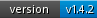

Badge-Poser
===========

Use shields for you GitHub repo,
documentation or website that show many times your project has been downloaded from Packagist.org or it’s latest stable version.


is still in ALPHA and you cannot use it.

[](https://packagist.org/) [](https://packagist.org/)
[](http://travis-ci.org/PUGX/badge-poser)

(Only the travis badge is real)


## Todo


0. Documentation

1. badge for download monthly and daily

2. badge for current last version

3. gather feedback about destroy this project or find a domain

4. some love to the image templates

5. cache


## Contribution

Active contribution and patches are very welcome.
To keep things in shape we have quite a bunch of unit tests. If you're submitting pull requests please
make sure that they are still passing and if you add functionality please
take a look at the coverage as well it should be pretty high :)

- First fork or clone the repository

```
git clone git://github.com/PUGX/badge-poser.git
cd badge-poser
```

- Install vendors:

``` bash
php composer.phar install --dev
```

- This will give you proper results:

``` bash
phpunit
```

