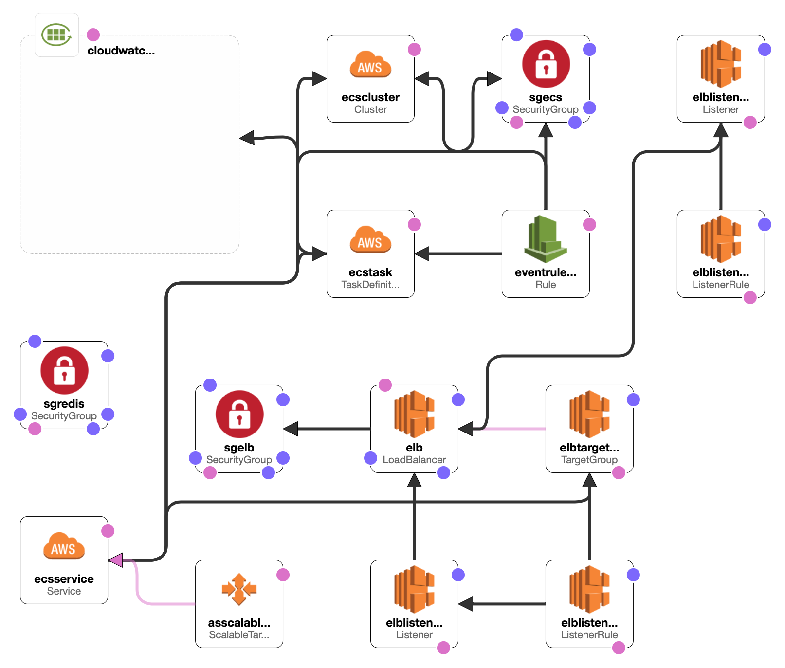

# SYS CONFIGS



## REQUIREMENTS

 - Ansible
 - AWS CloudFormation

## TOOLS

 - [StatusCake](https://app.statuscake.com) (Monitoring)
 - [Sentry.io](https://sentry.io/organizations/pugx) (Application Errors)

## SETUP

1. Create the AWS CloudFormation Stack using `cloudformation/stack.cf.yaml`.

## BUILD IMAGES

### Stable

```
ACCOUNT="XXXXXXXXXXXX";
aws ecr get-login-password --profile badge-poser | docker login --password-stdin -u AWS $ACCOUNT.dkr.ecr.eu-west-1.amazonaws.com

VER=$(date +%s);
docker build -t $ACCOUNT.dkr.ecr.eu-west-1.amazonaws.com/badge-poser:$VER -f sys/docker/Dockerfile .
docker push $ACCOUNT.dkr.ecr.eu-west-1.amazonaws.com/badge-poser:$VER
```

### Unstable

```
ACCOUNT="XXXXXXXXXXXX";
aws ecr get-login-password --profile badge-poser | docker login --password-stdin -u AWS $ACCOUNT.dkr.ecr.eu-west-1.amazonaws.com

VER=$(date +%s);
docker build -t $ACCOUNT.dkr.ecr.eu-west-1.amazonaws.com/badge-poser:nginx-$VER -f sys/docker/alpine-nginx/Dockerfile .
docker build -t $ACCOUNT.dkr.ecr.eu-west-1.amazonaws.com/badge-poser:phpfpm-$VER -f sys/docker/alpine-phpfpm/Dockerfile .

docker push $ACCOUNT.dkr.ecr.eu-west-1.amazonaws.com/badge-poser:nginx-$VER
docker push $ACCOUNT.dkr.ecr.eu-west-1.amazonaws.com/badge-poser:phpfpm-$VER
```

## DEPLOY

Update the task definition and switch version in the service.

## TESTING

### Stable

```
docker run --rm -it --name poser-redis -p 6379:6379 redis:latest
docker run --rm -it --name poser-all -p8081:80 --env-file=.env --link poser-redis:redis $ACCOUNT.dkr.ecr.eu-west-1.amazonaws.com/badge-poser:$VER
npm install artillery
./node_modules/.bin/artillery run sys/docker/artillery.yml
```
